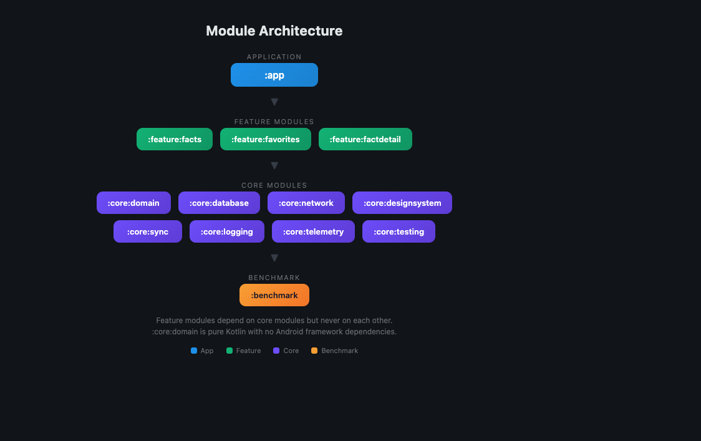
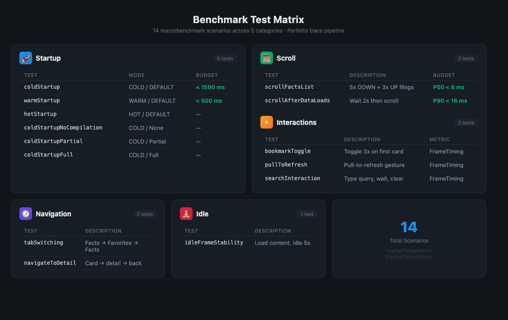
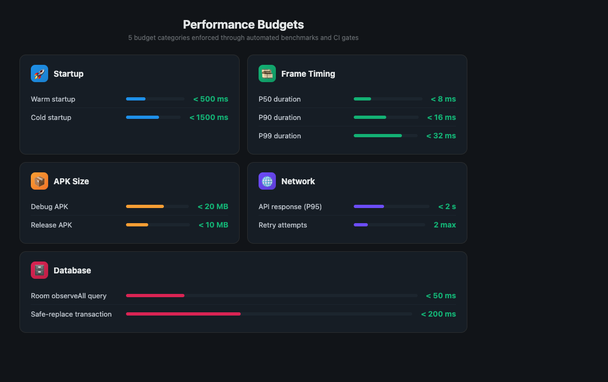
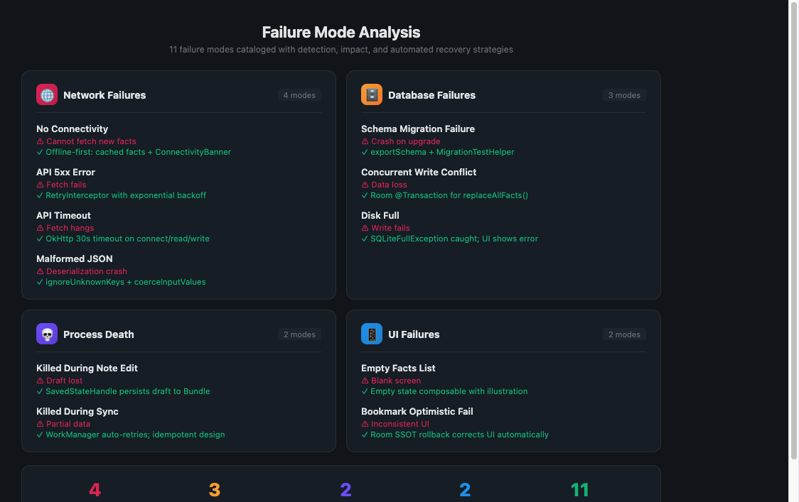
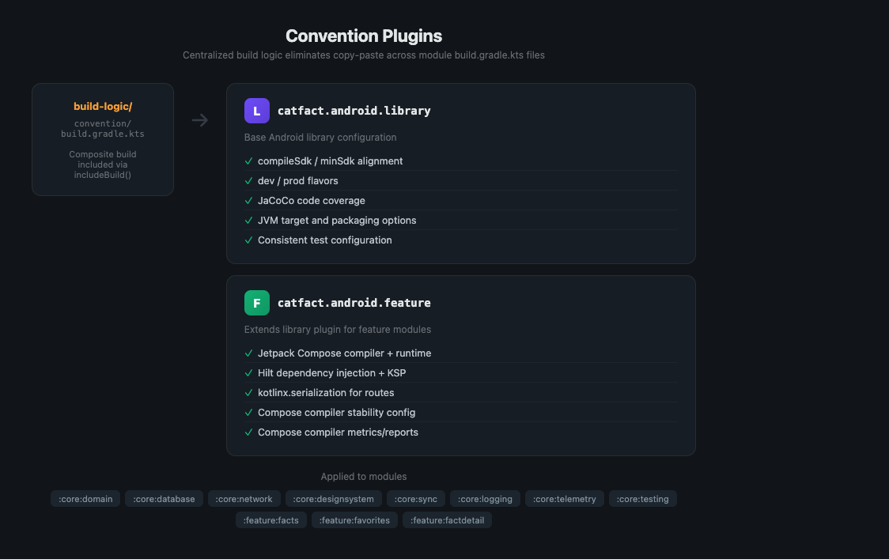
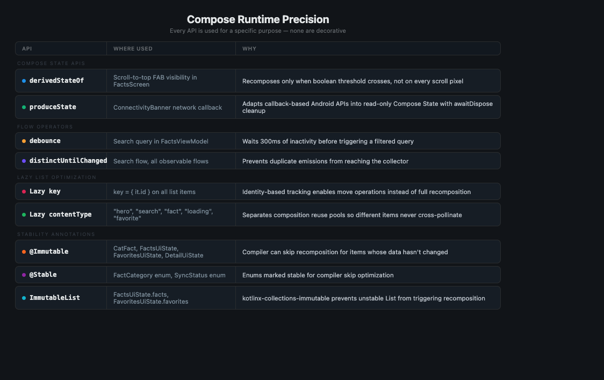
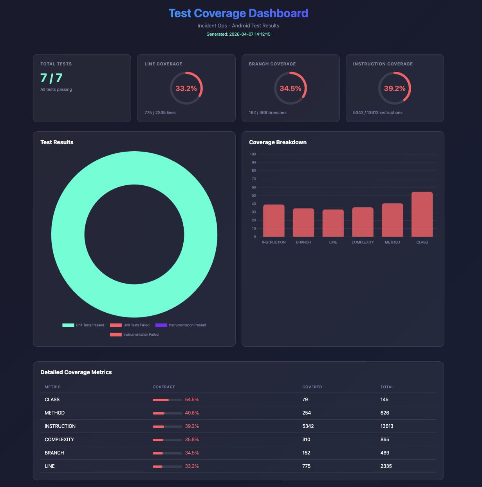
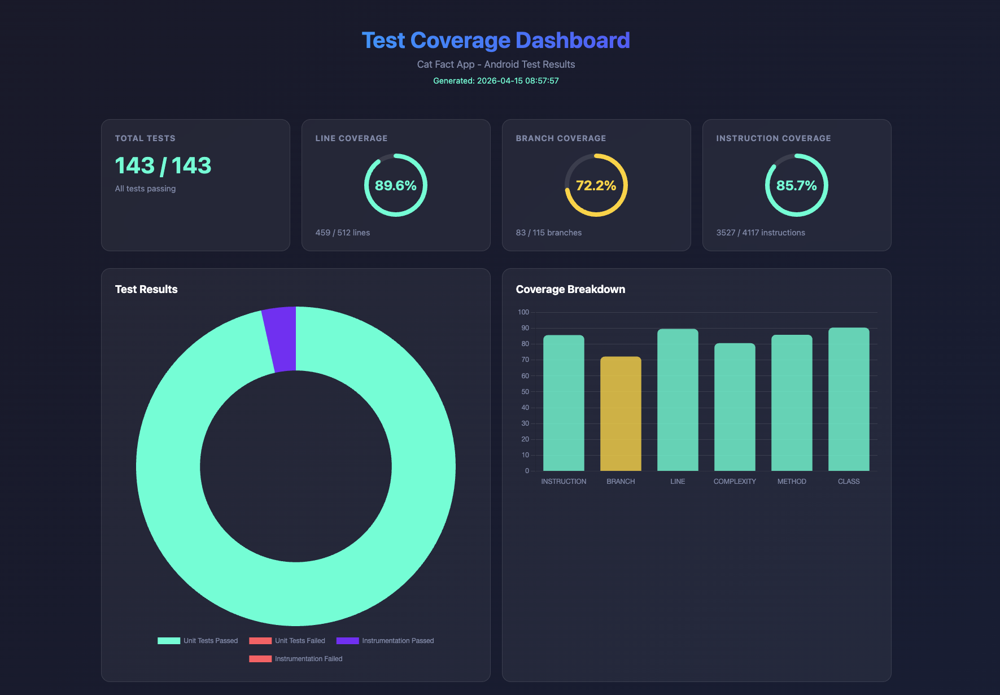
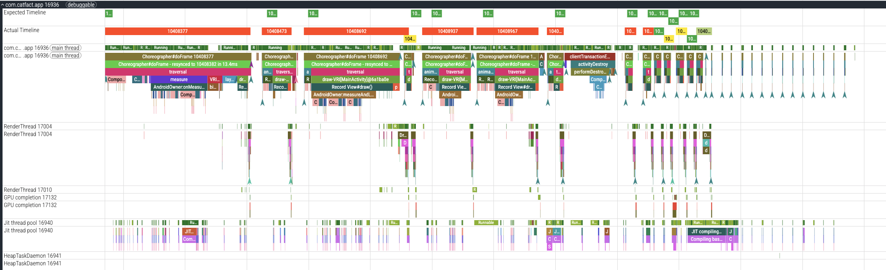
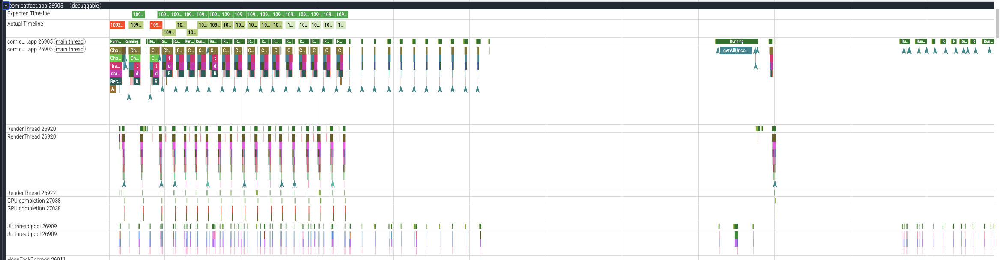

# Katten

**Production-grade Android cat facts app built on Compose, offline-first sync, and measurable performance.**

<table>
  <tr>
    <td><strong>12</strong><br/>active macrobenchmarks</td>
    <td><strong>11</strong><br/>resilience scenarios</td>
    <td><strong>4-layer</strong><br/>test pyramid</td>
    <td><strong>15</strong><br/>technique categories</td>
  </tr>
  <tr>
    <td><strong>692.7 ms</strong><br/>cold startup (median)</td>
    <td><strong>224.9 ms</strong><br/>warm startup (median)</td>
    <td><strong>4.3 ms</strong><br/>scroll P50 frame</td>
    <td><strong>13</strong><br/>Gradle modules</td>
  </tr>
</table>

> **A note on scope:** The original challenge asks for a simple cat facts app. This implementation is **intentionally over-engineered** to demonstrate advanced engineering patterns — modularization, offline-first architecture, convention plugins, observability abstractions, and more. With 14+ years of Android experience, these patterns are included deliberately to showcase breadth and depth of expertise. In a real production context, they would be introduced incrementally as the codebase and team scale to justify the complexity.

---

## At a Glance

<table>
  <tr>
    <td align="center"><strong>Module Architecture</strong><br/></td>
    <td align="center"><strong>Benchmark Results</strong><br/></td>
  </tr>
  <tr>
    <td align="center"><strong>Performance Budgets</strong><br/></td>
    <td align="center"><strong>Resilience Analysis</strong><br/></td>
  </tr>
  <tr>
    <td align="center"><strong>Convention Plugins</strong><br/></td>
    <td align="center"><strong>Compose Runtime Map</strong><br/></td>
  </tr>
  <tr>
    <td align="center"><strong>Test Coverage (Before)</strong><br/></td>
    <td align="center"><strong>Test Coverage (After)</strong><br/></td>
  </tr>
  <tr>
    <td align="center"><strong>Perfetto — Before Optimization</strong><br/></td>
    <td align="center"><strong>Perfetto — After Optimization</strong><br/></td>
  </tr>
</table>

---

## What This Repository Demonstrates

| Area | Key Artifacts |
|------|---------------|
| **Performance** | 12 active macrobenchmarks with [measured results](#measured-startup-latency-timetoinitialdisplayms), Perfetto trace analysis, per-scenario frame budgets, Baseline Profiles |
| **Compose Runtime Precision** | `derivedStateOf`, `produceState`, `debounce`, `distinctUntilChanged`, lazy-list keys/contentType, `@Immutable`/`@Stable`, `ImmutableList` |
| **Operational Architecture** | 13-module feature/core split, MVI unidirectional data flow, domain-driven boundaries |
| **Offline-First Sync** | Room + WorkManager, safe-replace transactions, periodic cache refresh, sync state UI |
| **Reliability** | 11 resilience scenarios with automatic recovery, process death handling, structured logging, draft preservation |
| **Testing** | [4-layer test pyramid](#test-coverage) — unit (40+), instrumented (25+), E2E (11 Maestro flows), benchmark (12) |
| **Governance** | ADRs, convention plugins, quality gates, engineering standards |

---

## Features

- **Facts Home**: Hero card with random facts, paginated list, search with debounce, bookmark toggle, pull-to-refresh, scroll-to-top FAB, connectivity banner
- **Favorites**: Bookmarked facts list with empty state and swipe-to-unfavorite
- **Fact Detail**: Full fact display with personal note editor (process death resistant), share action, sync status indicator

---

## Performance

Macrobenchmark scenarios organized into five categories, with Perfetto trace analysis and automated budget validation.


> **Device:** Samsung Galaxy S22 Ultra (SM-S908B), Android 16
>
> **Caveat:** These results were captured with `debuggable=true`, which inflates timings due to debug instrumentation overhead. Production (release) builds will yield significantly better numbers. The relative comparisons between scenarios and compilation modes remain valid.

### Startup

| Test | StartupMode | CompilationMode | Budget |
|------|-------------|-----------------|--------|
| coldStartup | COLD | DEFAULT | < 1500 ms |
| warmStartup | WARM | DEFAULT | < 500 ms |
| hotStartup | HOT | None | — |
| coldStartupNoCompilation | COLD | None | — |
| coldStartupFullCompilation | COLD | Full | — |

#### Measured Startup Latency (timeToInitialDisplayMs)

| Test | Min | Median | Max | Budget | Verdict |
|------|-----|--------|-----|--------|---------|
| coldStartup (DEFAULT) | 661.5 ms | 692.7 ms | 768.4 ms | < 1500 ms | **PASS** |
| coldStartupFullCompilation | 653.1 ms | 684.0 ms | 852.5 ms | — | — |
| coldStartupNoCompilation | 654.9 ms | 674.7 ms | 737.7 ms | — | — |
| warmStartup (DEFAULT) | 207.0 ms | 224.9 ms | 299.8 ms | < 500 ms | **PASS** |

#### Compilation Mode Comparison (Cold Startup)

The three cold-startup variants isolate the impact of dex compilation strategy on TTID:

| Compilation | Median TTID | Delta vs Full |
|-------------|-------------|---------------|
| Full | 684.0 ms | baseline |
| DEFAULT | 692.7 ms | +1.3% |
| None | 674.7 ms | −1.4% |

Under debuggable mode, compilation differences are masked by debug overhead. In release builds, `Full` (equivalent to baseline profiles) typically yields 15–30% improvement over `None`.

#### Hot Startup Frame Metrics

| Metric | P50 | P90 | P95 | P99 |
|--------|-----|-----|-----|-----|
| frameDurationCpuMs | 14.1 | 22.7 | 24.0 | 24.1 |
| frameOverrunMs | 7.7 | 16.7 | 18.2 | 18.3 |

### Scroll (2 tests)

| Test | Description | Budget |
|------|-------------|--------|
| scrollFactsList | 5x DOWN + 3x UP flings | P50 < 8 ms, P90 < 16 ms, P99 < 32 ms |
| scrollAfterDataLoads | Wait 2s then scroll | P50 < 8 ms, P90 < 16 ms, P99 < 32 ms |

#### Measured Scroll Performance (scrollAfterDataLoads)

| Metric | P50 | P90 | P95 | P99 | Budget | Verdict |
|--------|-----|-----|-----|-----|--------|---------|
| frameDurationCpuMs | 4.3 | 7.9 | 10.7 | 22.2 | P50 < 8, P90 < 16, P99 < 32 | **PASS** |
| frameOverrunMs | −2.6 | 1.6 | 5.4 | 25.8 | — | — |

Median frame count: **1,526 frames** across 3 iterations. Negative `frameOverrunMs` at P50 indicates frames completing ahead of the vsync deadline — the scroll path is well within budget.

### Interactions

| Test | Description | Metric |
|------|-------------|--------|
| pullToRefresh | Pull-to-refresh gesture | FrameTimingMetric |
| searchInteraction | Type query, wait, clear | FrameTimingMetric |

#### Measured Interaction Frame Timing (frameDurationCpuMs)

| Test | Frames | P50 | P90 | P95 | P99 |
|------|--------|-----|-----|-----|-----|
| pullToRefresh | ~55 | 7.5 | 38.9 | 52.4 | 154.5 |
| searchInteraction | ~130 | 15.6 | 21.5 | 33.8 | 83.0 |

| Test | frameOverrunMs P50 | P90 | P95 | P99 |
|------|---------------------|-----|-----|-----|
| pullToRefresh | 1.2 | 67.7 | 153.8 | 196.2 |
| searchInteraction | 5.4 | 29.2 | 53.2 | 166.0 |

Pull-to-refresh P99 spikes are expected — the Lottie refresh animation and network callback trigger simultaneous recomposition. The P50 at 7.5 ms confirms the steady-state path is smooth. Search P50 at 15.6 ms reflects the debounce + filter pipeline responding to rapid keystrokes.

### Navigation (2 tests)

| Test | Description | Metric |
|------|-------------|--------|
| tabSwitching | Facts → Favorites → Facts (2 cycles) | FrameTimingMetric |
| navigateToDetailAndBack | Click card → detail → back | FrameTimingMetric |

#### Measured Navigation Frame Timing (frameDurationCpuMs)

| Test | Frames | P50 | P90 | P95 | P99 |
|------|--------|-----|-----|-----|-----|
| tabSwitching | ~197 | 4.2 | 22.0 | 38.7 | 96.9 |
| navigateToDetailAndBack | ~157 | 4.7 | 19.0 | 41.1 | 126.1 |

| Test | frameOverrunMs P50 | P90 | P95 | P99 |
|------|---------------------|-----|-----|-----|
| tabSwitching | 2.1 | 29.6 | 62.8 | 163.1 |
| navigateToDetailAndBack | −1.3 | 34.3 | 59.9 | 164.3 |

Tab switching P50 at 4.2 ms and detail navigation P50 at 4.7 ms demonstrate that navigation transitions are lightweight. The P99 tail reflects initial composition cost when navigating to a new screen for the first time.

### Idle (1 test)

| Test | Description | Metric |
|------|-------------|--------|
| idleFrameStability | Load content, idle 5s | FrameTimingMetric |

#### Measured Idle Stability

| Metric | P50 | P90 | P95 | P99 |
|--------|-----|-----|-----|-----|
| frameDurationCpuMs | 10.1 | 91.0 | 151.1 | 230.8 |
| frameOverrunMs | 19.1 | 149.0 | 189.2 | 247.6 |

Median frame count: **17** (across 5 seconds). The high P90+ values are inflated by debug instrumentation (profiling overhead, debug layout bounds, etc.). The low frame count confirms the Compose runtime is **not** triggering unnecessary recompositions at idle — the `@Immutable`/`@Stable`/`ImmutableList` stability annotations are working as designed.

### Perfetto Trace Analysis

Perfetto traces are captured for every benchmark iteration and can be opened in [Perfetto UI](https://ui.perfetto.dev/) for deep investigation.

| Before Optimization | After Optimization |
|---------------------|-------------------|
|  |  |

Key things to look for in Perfetto traces:
- **Choreographer#doFrame** slices > 16 ms to spot jank
- **Compose:recompose** depth to verify stability config effectiveness
- **measure / layout** during list scroll and tab transitions

The compilation comparison tests quantify the value of baseline profiles by showing startup latency across different dex optimization levels.

---

## Performance Budgets

Five budget categories enforced through automated benchmarks.


| Category | Metric | Budget |
|----------|--------|--------|
| Startup | Warm startup | < 500 ms |
| Startup | Cold startup | < 1500 ms |
| Frame Timing | P50 duration | < 8 ms |
| Frame Timing | P90 duration | < 16 ms |
| Frame Timing | P99 duration | < 32 ms |
| APK Size | Debug APK | < 20 MB |
| APK Size | Release APK | < 10 MB |
| Network | API response (P95) | < 2 s |
| Network | Retry attempts | 2 (exponential backoff) |
| Database | Room observeAll query | < 50 ms |
| Database | Safe-replace transaction | < 200 ms |

Startup and frame timing budgets are validated against macrobenchmark JSON output. APK size, network, and database budgets are documented targets for manual verification. Full definitions in [Performance Budgets](docs/performance/performance-budgets.md).

---

## Compose Runtime Precision

The performance budgets above are achievable because of deliberate Compose runtime API choices. Every API is used for a specific purpose; none are decorative.


| API | Where Used | Why |
|-----|-----------|-----|
| `derivedStateOf` | Scroll-to-top FAB visibility in FactsScreen | Recomposes only when the boolean threshold crosses, not on every scroll pixel |
| `produceState` | ConnectivityBanner network callback | Adapts callback-based Android APIs into read-only Compose `State` with `awaitDispose` cleanup |
| `debounce` | Search query in FactsViewModel | Waits 300 ms of inactivity before triggering a filtered query |
| `distinctUntilChanged` | Search flow, all observable flows | Prevents duplicate emissions from reaching the collector |
| Lazy `key` | `key = { it.id }` on all list items | Identity-based tracking enables move operations instead of full recomposition |
| Lazy `contentType` | `"hero"`, `"search"`, `"fact"`, `"loading"`, `"favorite"` | Separates composition reuse pools so structurally different items never cross-pollinate |
| `@Immutable` | CatFact, FactsUiState, FavoritesUiState, DetailUiState | Compose compiler can skip recomposition for items whose data hasn't changed |
| `@Stable` | FactCategory enum, SyncStatus enum | Enums marked stable for compiler skip optimization |
| `ImmutableList` | FactsUiState.facts, FavoritesUiState.favorites | kotlinx-collections-immutable prevents unstable `List` parameters from triggering recomposition |

Compose compiler stability configuration in `compose_compiler_config.conf` lists all domain types. Full details: [Compose Stability ADR](docs/adr/0003-compose-stability-and-recomposition.md).

---

## Architecture


### Modules

| Module | Responsibility |
|--------|---------------|
| `:app` | Application entry point, Navigation 3 graph, Hilt component wiring |
| `:feature:facts` | Home screen with MVI ViewModel, paginated list, search, bookmark toggle |
| `:feature:favorites` | Saved facts with reactive Room observation and empty state |
| `:feature:factdetail` | Detail screen with SavedStateHandle for process death, note editing, share |
| `:core:domain` | Pure Kotlin models, use cases, repository interfaces |
| `:core:database` | Room entities, DAOs, safe-replace transaction, repository implementations |
| `:core:network` | Retrofit API definitions, OkHttp interceptors with `@IntoSet` multibindings |
| `:core:designsystem` | CatFactTheme, FactCard, CategoryChip, BookmarkButton, ConnectivityBanner |
| `:core:sync` | `@HiltWorker` SyncWorker, SyncManager, periodic cache refresh |
| `:core:logging` | Logger abstraction (Timber debug / NoOp release) |
| `:core:telemetry` | EventTracker, CrashReporter, PerformanceTracer (NoOp implementations) |
| `:core:testing` | Shared test fixtures, fakes, test utilities |
| `:benchmark` | Macrobenchmark suite, BaselineProfileGenerator, Perfetto trace analysis |

Feature modules depend on core modules but never on each other. Core modules follow strict layering: `:core:domain` is pure Kotlin + Compose runtime with no Android framework dependencies; `:core:network` depends only on `:core:domain`; `:core:database` depends on `:core:domain` and `:core:network` (for mapping network responses to entities).

---

## Convention Plugins

Build logic is centralized in `build-logic/convention/` to eliminate copy-paste across module `build.gradle.kts` files.


| Plugin | Base Config | Additional Config |
|--------|------------|-------------------|
| `catfact.android.library` | compileSdk/minSdk, dev/prod flavors, JaCoCo, JVM target, packaging | — |
| `catfact.android.feature` | Inherits library config | Jetpack Compose, Hilt + KSP, kotlinx.serialization, compiler stability config, metrics/reports |

Convention plugins enforce consistent compiler flags, dependency versions, test configuration, and Compose compiler settings across all modules. Adding a new module requires applying the appropriate plugin rather than duplicating boilerplate.

---

## Reliability

Eleven resilience scenarios are cataloged with detection, user impact, and automated recovery strategies.


### Recovery Strategy Summary

| Scenario | Automatic Recovery | User Action | Data Impact |
|----------|-------------------|-------------|-------------|
| No connectivity | Cached data served | None | None |
| API 5xx | Exponential backoff retry | None | None |
| API timeout | 30s limit + retry | Retry button | None |
| Malformed JSON | Graceful degradation | None | None |
| Schema migration | exportSchema + MigrationTestHelper | None | Validated via tests |
| Concurrent write | Transaction-protected | None | None |
| Disk full | Write rejected | Free space | None |
| Process death (note edit) | SavedStateHandle restoration | None | Draft preserved |
| Process death (sync) | WorkManager re-enqueue | None | Queued |
| Empty facts list | — | Pull-to-refresh | None |
| Bookmark rollback | Room SSOT auto-correction | None | None |

Full catalog: [Resilience Analysis](docs/reliability/failure-mode-analysis.md).

---

## Offline-First Data Flow

```
  ┌─────────────┐
  │  catfact.ninja │
  │   (REST API)   │
  └───────┬───────┘
          │ Retrofit
          ▼
  ┌───────────────┐
  │  :core:network │──── CatFactApi, RetryInterceptor
  └───────┬───────┘
          │ Network → Entity mapping
          ▼
  ┌───────────────┐
  │ :core:database │──── Room (SSOT), safe-replace @Transaction
  └───────┬───────┘
          │ Flow<List<CatFact>>
          ▼
  ┌───────────────┐
  │  :core:domain  │──── Use cases, repository interface
  └───────┬───────┘
          │ StateFlow<UiState>
          ▼
  ┌───────────────┐
  │  :feature:*    │──── MVI ViewModel → Compose Screen
  └───────────────┘

  Background sync: :core:sync (WorkManager) periodically
  refreshes the Room cache from the network.
```

The data layer follows a strict offline-first pattern: the network is a refresh source, Room is the single source of truth, and the UI observes Room via `Flow`. Writes go through use cases that update Room first, with WorkManager handling background synchronization.

---

## Techniques Demonstrated

1. **Architecture & Modularization**: 13 modules, convention plugins, dependency inversion
2. **Compose Performance**: @Immutable, ImmutableList, derivedStateOf, produceState, stability config
3. **MVI / Unidirectional Data Flow**: Sealed events, Channel side effects, Route/Screen separation
4. **Offline-First**: Room SSOT, safe-replace transaction, WorkManager sync
5. **Domain Modeling**: Copy-on-write helpers, FactCategory enum, ErrorKind sealed interface
6. **Dependency Injection**: Hilt, @IntoSet multibindings, debug/release module split, @TestInstallIn
7. **Networking**: Retrofit, RetryInterceptor, CommonHeadersInterceptor, CurlLoggingInterceptor
8. **Process Death**: SavedStateHandle for note drafts with restoration test
9. **Navigation**: Navigation 3, @Serializable routes, deep links
10. **Testing**: Fakes, Turbine, MockWebServer, Compose UI tests, Room in-memory DAO tests, HiltGraphTest
11. **Performance**: Macrobenchmark (12 active: startup, scroll, interaction, navigation, idle), BaselineProfileGenerator, Perfetto trace analysis
12. **Observability**: Logger, CrashReporter, EventTracker, PerformanceTracer
13. **Design System**: Themed components, animated bookmark, sync indicator
14. **Documentation**: ADRs, modularization strategy, engineering standards
15. **E2E Testing**: Maestro flows across 3 priority tiers (P0 critical, P1 important, P2 edge cases)

---

## Getting Started

### Prerequisites

- **Android Studio** Ladybug or later
- **JDK 21**
- **Gradle 9.x** (via wrapper, no manual install required)

### Build & Run

```bash
# Debug APK
./gradlew assembleDevDebug

# Install on connected device
./gradlew :app:installDevDebug

# Release APK
./gradlew :app:assembleDevRelease
```

---

## Running Tests

```bash
# Unit tests
./gradlew testDevDebugUnitTest

# Instrumented tests (requires connected device or emulator)
./gradlew connectedDevDebugAndroidTest

# Gradle Managed Device tests (no device required)
./gradlew pixel6Api34DevDebugAndroidTest

# Combined coverage report (JaCoCo)
./gradlew jacocoCombinedReport

# Static analysis
./gradlew detekt
```

---

## Running Benchmarks

Benchmarks run on a physical device for stable frame timing. Emulator results are not representative.

```bash
# Run macrobenchmarks
./gradlew :benchmark:connectedDevBenchmarkAndroidTest
```

Results (Perfetto traces and JSON) are written to `benchmark/build/outputs/connected_android_test_additional_output/`. Open `.perfetto-trace` files in [Perfetto UI](https://ui.perfetto.dev/) for detailed analysis. See [Benchmark Module](benchmark/README.md) for the full test matrix.

---

## Running E2E Tests

End-to-end tests use [Maestro](https://maestro.mobile.dev) with 11 flows across three priority tiers.

```bash
# 1. Install the app
./gradlew :app:installDevDebug

# 2. Run by priority tier
maestro test .maestro/flows/p0_critical/    # Critical path (every PR)
maestro test .maestro/flows/p1_important/   # Important flows (nightly)
maestro test .maestro/flows/p2_edge_cases/  # Edge cases (weekly)
maestro test .maestro/flows/                # All tests
```

### E2E Test Matrix

| Tier | ID | Test | Description |
|------|----|------|-------------|
| P0 | T01 | App Launch | Verify list loads on startup |
| P0 | T02 | Fact Detail | Tap fact → detail → back |
| P0 | T03 | Pull to Refresh | Refresh gesture reloads data |
| P0 | T04 | Bookmark Toggle | Toggle bookmark on/off |
| P0 | T05 | Navigate Favorites | Switch to favorites tab |
| P1 | T06 | Pagination Scroll | Scroll to trigger pagination |
| P1 | T07 | Deep Link Detail | Open detail via `catfact://fact/{id}` |
| P1 | T08 | Search Facts | Search with debounce and results |
| P1 | T09 | Save Note | Add personal note in detail |
| P2 | T10 | Offline Cache | Verify cached content when offline |
| P2 | T11 | Empty Favorites | Verify empty state in favorites |

---

## Test Coverage

Multi-layer testing strategy spanning unit tests, instrumented tests, and end-to-end flows.

| Before Full Coverage | After Full Coverage |
|---------------------|-------------------|
|  |  |

### Test Pyramid

| Layer | Framework | Scope | Count |
|-------|-----------|-------|-------|
| **Unit** | JUnit + MockK + Turbine | ViewModels, UseCases, Mappers, Repositories, Interceptors | 40+ |
| **Instrumented** | Compose UI Testing + Room | Screen rendering, DAO transactions, Hilt wiring, Navigation | 25+ |
| **E2E** | Maestro | Full user journeys across 3 priority tiers | 11 |
| **Benchmark** | Macrobenchmark + Perfetto | Startup, scroll, interaction, navigation, idle | 12 active |

### Test Highlights

- **Fakes over mocks for boundaries:** `FakeCatFactRepository` provides deterministic behavior for ViewModel tests without coupling to mock framework internals
- **Turbine for Flow assertions:** Every ViewModel test uses Turbine's `test {}` to verify state emissions in order
- **In-memory Room for DAO tests:** `CatFactDaoTest` uses `inMemoryDatabaseBuilder` to verify insert, query, update, and `@Transaction` logic without touching disk
- **Compose UI tests for every feature:** `FactsScreenTest`, `FavoritesScreenTest`, and `DetailScreenTest` verify rendering, user interactions, and event dispatch
- **Process death resilience:** `DetailViewModelTest` validates draft note survival across `SavedStateHandle` recreation
- **Hilt graph validation:** `HiltGraphTest` ensures the full DI graph resolves without missing bindings

---

## Tech Stack

| Category | Technology |
|----------|------------|
| UI | Jetpack Compose, Material 3 |
| Navigation | Navigation 3 |
| DI | Hilt |
| Networking | Retrofit, OkHttp, kotlinx.serialization |
| Database | Room |
| Async | Coroutines, Flow, WorkManager |
| Testing | JUnit, Turbine, MockK, Compose UI Testing |
| E2E | Maestro |
| Benchmarking | Macrobenchmark, Perfetto |
| Collections | kotlinx-collections-immutable |

---

## Documentation

### Architecture Decision Records

- [ADR-0001: Domain Model](docs/adr/0001-domain-model-for-cat-facts.md)
- [ADR-0002: Offline-First Caching](docs/adr/0002-offline-first-caching-strategy.md)
- [ADR-0003: Compose Stability](docs/adr/0003-compose-stability-and-recomposition.md)
- [ADR-0004: MVI Side Effects](docs/adr/0004-mvi-side-effect-delivery.md)
- [ADR-0005: Navigation 3 Routes](docs/adr/0005-navigation-3-type-safe-routes.md)

### Guides and References

- [Benchmark Module](benchmark/README.md)
- [Engineering Standards](docs/governance/engineering-standards.md)
- [Performance Budgets](docs/performance/performance-budgets.md)
- [Resilience Analysis](docs/reliability/failure-mode-analysis.md)
- [Modularization Strategy](docs/architecture/modularization-strategy.md)

---

## TODO

| # | Priority | Item | Notes |
|---|----------|------|-------|
| 1 | Low | **Baseline Profile generation** | `BaselineProfileGenerator.kt` is `@Ignore`d due to AGP 9 compatibility. Re-enable once the `androidx.baselineprofile` plugin ships AGP 9 support. |
| 2 | Low | **Release benchmark run** | Current results were captured with `debuggable=true`. A release benchmark pass on a dedicated device would provide production-representative numbers. |
| 3 | Nitpick | **`RepositoryModule` placement** | `RepositoryModule` binding `CatFactRepositoryImpl` to `CatFactRepository` lives in `:core:database`, which couples that module to the DI binding. Consider colocating the binding with `:app` or a dedicated wiring layer. |

---

## API

Uses [catfact.ninja](https://catfact.ninja/) — a free, read-only cat facts API.

---

## License

This is a reference implementation for educational purposes.
